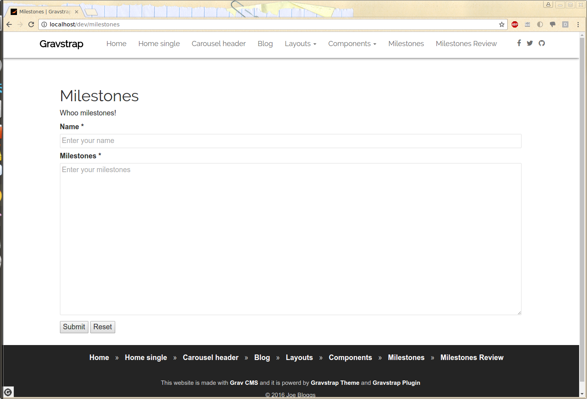
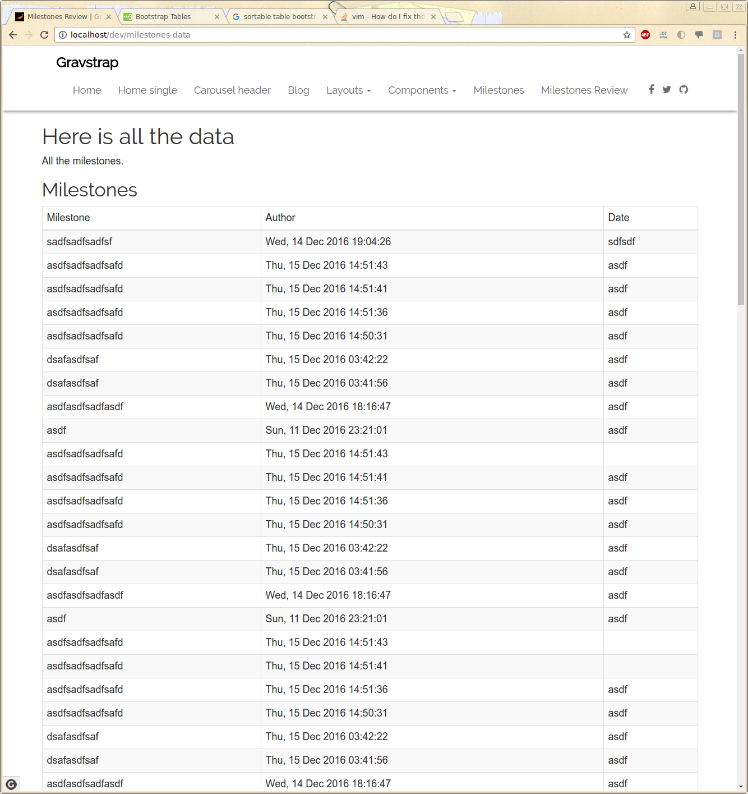

# Milestones Plugin

The **Milestones** Plugin is for [Grav CMS](http://github.com/getgrav/grav). 

## Installation

From the root of your Grav install type:

    bin/gpm install milestones

This will install the Milestones plugin into your `/user/plugins` directory within Grav. Its files can be found under `/your/site/grav/user/plugins/milestones`.

## Configuration

Before configuring this plugin, you should copy the `user/plugins/milestones/milestones.yaml` to `user/config/plugins/milestones.yaml` and only edit that copy.

Here is the default configuration and an explanation of available options:

```yaml
enabled: true
```

## Usage


### 1

Create a form and in the process section, include milestones.

`/var/www/html/grav/user/pages/08.milestones/form.md`


	---
	title: Milestones
	slug: milestones

	form:
	    name: milestones

	    fields:
		- name: name
		  label: Name
		  placeholder: Enter your name
		  autofocus: on
		  autocomplete: on
		  type: text
		  validate:
		    required: true


		- name: milestones
		  label: Milestones 
		  placeholder: Enter your milestones 
		  type: textarea
		  rows: 15
		  validate:
		    required: true

	    buttons:
		- type: submit
		  value: Submit
		- type: reset
		  value: Reset

	    process:
		- message: Thank you for the milestones!
		- display: thankyou
		- milestones:

	---

	# Milestones 

	Whoo milestones!

### 2

Make sure to also create a "thankyou" subdirectory if you want to display a confirmation page with the data submitted

`/var/www/html/dev/user/pages/08.form/thankyou $ vi thankyou.md`

	---
	title: Thank you
	cache_enable: false
	process:
	    twig: true
	---

	## Thanks for submitting your milestones!

### 3

To make your form look pretty, you can also add this file:

`/var/www/html/dev/user/themes/gravstrap-theme/css $ vi custom.css`

	fieldset {
	  border: 1px solid #ddd; }

	input, textarea {
	    transition: border-color;
	    border-radius: .1875rem;
	    margin-bottom: .85rem;
	    padding: .425rem .425rem;
	    width: 100%;
	    border: 1px solid #ddd;
	}
### 4

Finally add a page to display all the data. Name it `milestones_data` to match our `.html.twig` template

`/var/www/html/grav/user/pages/09.milestones_data/milestones_data.md`

	---
	title: Milestones Review 
	slug: milestones-data
	metadata:
	    description: Milestones data
	    author: nouyang 

	---

	# Here is all the data
	All the milestones.

## Explanation

### Processing the form


```
form:
    process:
         - milestones:
```

In milestones.php, we create a new onFormProcessed, and catch the action "milestones".
We take the form input, turn it into yaml, and we store as /user/data/milestones/$name.yaml
See "data example" section for format.

### Displaying the contents

We take the data directory, get a list of all files in it, parse all files as YAML, and create "milestones" array containing all the milestones that we pass to Twig as a variable.

In the templates/milestones_data.html.twig, we loop through the array and display each milestone with the author and date in a table.

#### Data example

```
nrw@nrw-PC:/var/www/html/dev/user/data/milestones$ ls
adfsf.yaml  ads.yaml  asdf.yaml  sdfsdf.yaml

nrw@nrw-PC:/var/www/html/dev/user/data/milestones$ cat *
name: adfsf
milestones:
    - { text: adf, date: 'Sat, 10 Dec 2016 23:58:17' }
name: ads
milestones:
    - { date: 'Thu, 15 Dec 2016 03:42:38', text: asdfasadfasdf }
    - { date: 'Thu, 15 Dec 2016 03:43:09', text: asdfasadfasdf }
name: asdf
milestones:
    - { text: asdf, date: 'Sun, 11 Dec 2016 23:21:01' }
    - { text: asdfasdfsadfasdf, date: 'Wed, 14 Dec 2016 18:16:47' }
    - { date: 'Thu, 15 Dec 2016 03:41:56', text: dsafasdfsaf }
    - { date: 'Thu, 15 Dec 2016 03:42:22', text: dsafasdfsaf }
name: sdfsdf
milestones:
    - { date: 'Wed, 14 Dec 2016 19:04:26', text: sadfsadfsadfsf }
```


#### Screenshots





## Credits

Thanks to the cat gifs on the internet.

## To Do

- [ ] Add in dependencies for this plugin (form plugin)
- [x] Display milestones somewhere
- [ ] Add file uploads
- [ ] Display file uploads with milestone
- [ ] Make sortable the display of all milestones

###

Spec

4 pages.

